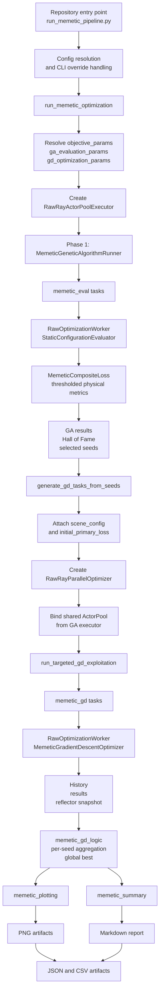

# Memetic Fusion Pipeline

> Scope: comprehensive onboarding guide for the current standalone memetic
> pipeline implementation. This document is written for new contributors who
> need to understand how the program flows from the repository entry point to
> the final saved artifacts.

---

## Table of Contents

1. [What This Pipeline Does](#1-what-this-pipeline-does)
2. [What Changed After the Refactor](#2-what-changed-after-the-refactor)
3. [High-Level Architecture](#3-high-level-architecture)
4. [Execution Flow from Start to Finish](#4-execution-flow-from-start-to-finish)
5. [Entry Point: Root Launcher](#5-entry-point-root-launcher)
6. [Main Orchestrator: run_memetic_optimization](#6-main-orchestrator-run_memetic_optimization)
7. [Configuration Model](#7-configuration-model)
8. [Phase 1: Genetic Algorithm Macro-Exploration](#8-phase-1-genetic-algorithm-macro-exploration)
9. [Phase 2: Seed-to-GD Bridge](#9-phase-2-seed-to-gd-bridge)
10. [Phase 3: Targeted GD Micro-Exploitation](#10-phase-3-targeted-gd-micro-exploitation)
11. [Raw Ray Execution Layer](#11-raw-ray-execution-layer)
12. [Reporting and Artifact Generation](#12-reporting-and-artifact-generation)
13. [Returned Data Structures](#13-returned-data-structures)
14. [Saved Files and Directory Layout](#14-saved-files-and-directory-layout)
15. [Practical Debugging Guide](#15-practical-debugging-guide)
16. [Extension Guide for New Contributors](#16-extension-guide-for-new-contributors)
17. [Recommended Reading Order](#17-recommended-reading-order)

---

## 1. What This Pipeline Does

The memetic pipeline is a two-stage optimization workflow for access-point and
reflector placement.

It combines:

1. A genetic algorithm to explore the search space broadly.
2. A gradient-descent stage to exploit a small number of promising seeds.

The pipeline is called "memetic" because it mixes:

- a global search phase that is good at exploration, and
- a local search phase that is good at refinement.

At a high level, the workflow is:

1. Generate and evolve candidate AP and reflector configurations with GA.
2. Score every valid candidate on one shared standalone loss manifold.
3. Keep a Hall of Fame of strong candidates.
4. Select a small number of spatially distinct seeds.
5. Convert those seeds into GD initialization tasks.
6. Run GD from each seed using the same shared objective and the same hot Ray workers.
7. Save plots, JSON summaries, CSV tables, and a markdown report.

This gives a practical balance between search diversity and local refinement
without mixing legacy fairness switches into the current implementation.

---

## 2. What Changed After the Refactor

This document describes the current standalone memetic implementation, not the
older mixed path that reused legacy fairness and grid-search behavior.

The important architectural changes are:

- the pipeline now has a dedicated shared loss module in `memetic_loss.py`,
- GA now evaluates candidates through a standalone static evaluator,
- GD now runs through a dedicated memetic gradient-descent optimizer,
- config is separated into shared objective parameters, GA evaluation
  parameters, and GD optimization parameters,
- reporting uses one generic payload contract instead of older ad hoc metric
  names.

The shared objective is `MemeticCompositeLoss`.

That matters because GA and GD are now optimizing the same mathematical target:

- GA maximizes `primary_fitness`, which is `-primary_loss`,
- GD minimizes `primary_loss`,
- both derive their scalar objective from the same loss module.

The refactor also standardized physical reporting.

Current reporting rules are:

- `min_rss_dbm`, `p5_rss_dbm`, and `mean_rss_dbm` are computed only over cells
  above the configured coverage threshold,
- `coverage_pct` is computed as the percentage of all cells above that same
  threshold.

This keeps the implementation easier to maintain because objective definition,
task execution, and human-readable reporting are now cleanly separated.

---

## 3. High-Level Architecture



### Core Modules

| Module | Main Responsibility |
| --- | --- |
| `run_memetic_pipeline.py` at repo root | User-facing launcher |
| `src/.../memetic/run_memetic_pipeline.py` | Main orchestration |
| `memetic_loss.py` | Shared standalone differentiable objective |
| `memetic_ga_evaluator.py` | Static evaluator for one GA candidate |
| `memetic_ga_logic.py` | GA exploration and seed extraction |
| `memetic_bridge.py` | Seed-to-GD task translation |
| `memetic_gd_optimizer.py` | Standalone GD optimizer |
| `memetic_gd_logic.py` | GD execution aggregation and analysis |
| `raw_ray_parallel_optimizer.py` | Raw worker pool and distributed execution |
| `memetic_plotting.py` | Plot generation |
| `memetic_summary.py` | Markdown summary generation |

---

## 4. Execution Flow from Start to Finish

This section is the most useful mental model for new contributors.

### Step 1: user launches the program

The usual command is:

```bash
python run_memetic_pipeline.py --config configs/memetic_pipeline_config.json
```

The root script resolves the config, applies CLI overrides, and calls the real
orchestrator.

### Step 2: orchestrator reads and normalizes config

The internal memetic pipeline module reads values such as:

- scene settings,
- search bounds,
- GA parameters,
- GD parameters,
- Ray pool size,
- output location.

It then resolves three important config blocks:

1. `objective_params`
2. `ga_evaluation_params`
3. `gd_optimization_params`

This is how the current implementation keeps the shared objective clean while
still letting GA and GD have different execution settings.

### Step 3: Ray workers are created once

The orchestrator creates a `RawRayActorPoolExecutor`.

Each actor loads a heavy scene instance only once. This is important because
scene parsing, geometry setup, and GPU warmup are expensive.

### Step 4: GA evaluates candidate individuals in parallel

The GA runner uses DEAP, but parallel evaluation is injected through
`executor.map`.

Each valid individual becomes a `memetic_eval` task.

Inside the worker, the task is evaluated by `StaticConfigurationEvaluator`,
which:

1. configures AP positions and optional directions,
2. configures the reflector when enabled,
3. solves one radio map,
4. computes `MemeticCompositeLoss`,
5. returns standardized payload fields.

### Step 5: GA selects topologically distinct seeds

After evolution, the GA runner uses its Hall of Fame to select a small number
of diverse seeds rather than only the numerically top-ranked ones.

This avoids wasting GD runs on near-duplicate geometries.

### Step 6: bridge translates seeds into GD tasks

The bridge validates seed schemas and constructs GD-compatible work items.

These tasks contain:

- AP initial positions,
- optional initial directions,
- reflector initialization,
- GD optimization parameters.

The orchestrator then attaches additional metadata such as:

- `scene_config`, and
- `initial_primary_loss` derived from GA fitness.

### Step 7: GD reuses the same worker pool

Instead of creating a second independent pool, the orchestrator binds the
existing GA actor pool into `RawRayParallelOptimizer`.

This means the same hot workers now execute the GD tasks.

### Step 8: GD runs on the same shared objective

GD tasks are submitted with `optimizer_method="memetic_gd"`.

Inside each worker, `MemeticGradientDescentOptimizer`:

1. reconstructs trainable AP and optional reflector state,
2. solves the scene differentiably,
3. minimizes the shared `MemeticCompositeLoss` plus repulsion,
4. records rich iteration history and a standardized best/final result summary.

### Step 9: GD results are aggregated outside the worker layer

The raw parallel optimizer returns raw task results only. It does not decide
what the best result means for GD.

`memetic_gd_logic.py` then:

1. maps task IDs back to seeds,
2. computes initial, best, and final primary losses,
3. computes improvement statistics,
4. identifies the global best GD task.

### Step 10: artifacts are generated

The orchestrator saves:

- JSON summaries,
- CSV tables,
- GA and GD plots,
- a markdown summary report.

### Step 11: resources are cleaned up

The pipeline shuts down the shared executor and then shuts down Ray in a
`finally` block so resources are cleaned up even when a run fails.

---

## 5. Entry Point: Root Launcher

File: `run_memetic_pipeline.py`

This is the convenience script that makes the system easy to run from the
repository root.

### Why this file exists

Without it, the user would need to call a deeper Python module manually and set
up paths themselves.

Instead, the launcher:

1. finds the repository root,
2. adds `src/` to `sys.path`,
3. loads or creates a config file,
4. applies CLI overrides,
5. calls `run_memetic_optimization(config)`.

### Supported CLI options

| Flag | Purpose |
| --- | --- |
| `--config` | path to config JSON |
| `--output-dir` | override artifact output directory |
| `--run-name` | optional subfolder name for the run |
| `--verbose` | force verbose logging |
| `--dry-run` | print resolved config and exit |
| `--hints` | print quick usage advice |

### Typical launcher behavior

If the config file does not exist, the launcher writes a template config based
on the default memetic configuration.

That makes onboarding easier because a new user can run the file once and get a
valid starting config immediately.

---

## 6. Main Orchestrator: run_memetic_optimization

File: `src/reflector_position/optimizers/memetic/run_memetic_pipeline.py`

Primary function:

- `run_memetic_optimization(config_args)`

This is the true control center of the memetic system.

### What this function owns

It owns the full run lifecycle:

1. reading config values,
2. resolving shared and phase-specific parameters,
3. creating shared workers,
4. launching GA,
5. building GD tasks,
6. launching GD,
7. saving artifacts,
8. returning a final summary object.

### Important local helpers in the orchestrator

| Helper | Purpose |
| --- | --- |
| `_coerce_mapping` | normalize config sections with optional legacy fallback |
| `_resolve_objective_params` | build shared memetic loss parameters |
| `_resolve_ga_evaluation_params` | build GA evaluator worker params |
| `_resolve_gd_optimization_params` | build GD optimize params |
| `_deep_update` | recursive config merge |
| `_load_json_config` | read config from disk |
| `_build_cli_parser` | CLI parser for direct module execution |
| `_to_jsonable` | serialize complex values for JSON |
| `_write_json` | save JSON artifacts |
| `_write_csv` | save CSV tables |
| `_save_memetic_artifacts` | central artifact saving |
| `_bind_shared_actor_pool` | reuse the GA ActorPool for GD |
| `_default_scene_config` | example default scene config |
| `_default_memetic_config` | example default pipeline config |

### Why `_bind_shared_actor_pool` is important

This helper reuses private pool state from the GA executor so that the GD phase
can run on the same worker actors.

That is a deliberate design tradeoff:

- it is slightly low-level,
- but it avoids reloading scenes and rebuilding contexts.

For this project, that tradeoff is worth it.

---

## 7. Configuration Model

The pipeline expects a JSON object. The default config in the code and the
project config file use the same general structure.

### Top-level configuration keys

| Key | Meaning |
| --- | --- |
| `scene_config` | scene and hardware setup |
| `output_dir` | root output directory |
| `position_bounds` | XY search region |
| `fixed_z` | shared AP height |
| `num_pool_workers` | Ray worker count |
| `gpu_fraction` | GPU allocation per worker |
| `random_seed` | reproducibility seed |
| `num_aps` | number of access points |
| `min_ap_separation` | GA AP separation constraint |
| `optimize_orientation` | whether AP direction is optimized |
| `reflector_enabled` | whether reflector optimization is enabled |
| `focal_z` | reflector focal target z |
| `objective_params` | shared memetic objective hyperparameters |
| `ga_params` | DEAP evolution hyperparameters |
| `ga_evaluation_params` | static evaluator runtime settings for GA |
| `k_seeds` | number of seeds sent to GD |
| `d_corr` | spatial diversity threshold for seed selection |
| `gd_optimization_params` | GD runtime and objective settings |
| `verbose` | logging verbosity |

### `scene_config`

This usually includes:

- `scene_path`
- `frequency`
- `tx_power_dbm`
- `tx_positions`
- `reflector_enabled`
- `reflector_size`
- `wall_top_left`
- `wall_bottom_right`
- `focal_point`
- `device`

### `position_bounds`

The XY search space is defined by:

- `x_min`
- `x_max`
- `y_min`
- `y_max`

### `objective_params`

This section owns the shared standalone objective.

Common values include:

- `alpha`
- `beta`
- `softmin_temperature`
- `coverage_threshold_dbm`
- `coverage_temperature`

These values are resolved once and then merged into both GA evaluation params
and GD optimization params.

### `ga_evaluation_params`

This section owns the forward-pass settings for static GA evaluation.

Common values include:

- `samples_per_tx`
- `max_depth`
- `verbose`

### `gd_optimization_params`

This section owns local-search settings for GD.

Common values include:

- `num_iterations`
- `learning_rate`
- `samples_per_tx`
- `max_depth`
- `verbose`

The shared objective fields are merged into this section by the orchestrator,
so new configs do not need to duplicate them here.

### Legacy compatibility

The orchestrator still accepts older config keys:

- `ga_optimization_params`
- `gd_hyperparams`

Those keys are supported only as a compatibility bridge.

New standalone configs should use:

- `objective_params`
- `ga_evaluation_params`
- `gd_optimization_params`

Legacy fairness keys such as:

- `use_soft_min`
- `shadow_quantile`
- `fairness_loss_type`

do not belong in the standalone memetic config model.

---

## 8. Phase 1: Genetic Algorithm Macro-Exploration

File: `src/reflector_position/optimizers/memetic/memetic_ga_logic.py`

Primary class:

- `MemeticGeneticAlgorithmRunner`

This module owns the exploration phase.

### 8.1 Design goals of the GA phase

The GA phase is responsible for:

- broad exploration,
- topological diversity,
- good seed quality for downstream GD.

The goal is not only to find one strong candidate, but to produce several
useful starting points for local search.

### 8.2 DEAP setup

The module creates DEAP creator types only once:

- `MemeticFitnessMax`
- `MemeticIndividual`

This avoids repeated creator registration issues when the module is imported
multiple times.

### 8.3 Chromosome encoding

The chromosome is a flat float vector.

For `num_aps = N`, it has up to three regions:

1. AP XY positions.
2. AP XY direction components.
3. Reflector genes.

#### Position genes

There are `2N` position genes:

```text
[x0, y0, x1, y1, ..., xN-1, yN-1]
```

The z-coordinate is fixed globally by `fixed_z`.

#### Direction genes

If orientation optimization is enabled, there are `2N` more genes:

```text
[dx0, dy0, dx1, dy1, ..., dxN-1, dyN-1]
```

These are converted into 3D unit vectors by combining them with a fixed
`dir_z` and normalizing.

#### Reflector genes

If reflector optimization is enabled, four more genes are appended:

```text
[u, v, focal_x, focal_y]
```

The focal z-value is injected from `focal_z`.

### 8.4 Constraint handling

When there are at least two APs, the runner checks minimum pairwise AP
separation in the XY plane.

Invalid individuals are not dispatched to workers. They are penalized locally
with a very large negative primary fitness.

This is important because it reduces wasted worker calls and guarantees that
invalid configurations remain uncompetitive during selection.

### 8.5 Mutation strategy

Mutation is not uniform across all genes.

The module uses `_split_mutate(...)`, which applies different sigmas to:

- position genes,
- direction genes,
- reflector genes.

That keeps mutation behavior physically reasonable across different parameter
types.

### 8.6 Parallel evaluation contract

The GA itself does not know anything about Ray.

Instead, the execution layer is injected through `executor_map`, and DEAP uses
that function as its `toolbox.map` implementation.

This means the GA module remains focused on search logic, not distributed
execution details.

### 8.7 How one individual becomes one worker task

The runner converts each valid individual into a `memetic_eval` worker task.

The task payload includes the decoded AP state and, when relevant:

- AP directions,
- reflector parameters,
- solver settings,
- `loss_kwargs` for `MemeticCompositeLoss`.

This is the key design difference from the older path: GA evaluation is now a
standalone static scoring pass, not a reused legacy optimizer mode.

### 8.8 Fitness and readable metrics

The GA maximizes `primary_fitness`, which is the negative of the shared primary
loss.

The evaluator also returns:

- `loss_components`, and
- `physical_metrics`.

This separation is deliberate:

- search operates on one scalar objective,
- humans inspect component losses and detached physical metrics.

### 8.9 Generation statistics

Generation reporting intentionally excludes infeasible penalty values from the
reported mean and standard deviation when feasible individuals exist.

That is why generation rows now contain fields such as:

- `feasible_count`
- `penalized_count`
- `mean_population_fitness`

This keeps selection pressure intact while making the reported statistics much
more readable.

### 8.10 Hall of Fame and seed extraction

After evolution, the Hall of Fame is used as the source of seed candidates.

The runner then applies a topological diversity filter:

1. accept the best candidate,
2. scan remaining Hall-of-Fame members in fitness order,
3. accept a new seed only if it is at least `d_corr` away from all accepted
   seeds.

Distance logic:

- one AP: Euclidean distance in XY,
- two APs: minimum of direct and swapped assignment distance,
- more than two APs: index-wise RMS distance.

### 8.11 GA outputs used downstream

The orchestrator currently relies on GA outputs such as:

- `seeds`
- `generation_details`
- `best_primary_fitness`
- `best_loss_components`
- `best_physical_metrics`
- `num_selected_seeds`

The `seeds` payload is what drives phase 2.

---

## 9. Phase 2: Seed-to-GD Bridge

File: `src/reflector_position/optimizers/memetic/memetic_bridge.py`

Primary function:

- `generate_gd_tasks_from_seeds(...)`

This module translates GA seeds into valid GD work items.

### 9.1 Why this module exists

The GA seed schema is not identical to the constructor schema expected by the
GD optimizer.

The bridge exists to:

- validate seed shape,
- normalize field names,
- build deterministic task dictionaries,
- avoid leaking translation logic into the orchestrator.

### 9.2 Supported seed formats

For positions, the bridge accepts either:

- `positions`, or
- `ap_positions`

For directions, it accepts either:

- `directions`, or
- `ap_directions`

For reflector data, it accepts either:

1. a flat schema using `reflector_u`, `reflector_v`, and `focal_point`, or
2. a nested `reflector` dictionary containing `u`, `v`, `focal_x`, `focal_y`, `focal_z`.

### 9.3 Validation behavior

The bridge validates:

- that each position is a 3D vector,
- that the number of AP positions matches `num_aps`,
- that all APs share the same z-value,
- that optional directions also match `num_aps`,
- that required reflector fields exist when reflector mode is enabled.

If validation fails, the bridge raises a `ValueError` early.

### 9.4 Generated GD task fields

Each output task usually contains:

- `initial_positions`
- `fixed_z`
- `num_aps`
- `optimize_orientation`
- `initial_orientations`
- `initial_directions_xy`
- `reflector_u`
- `reflector_v`
- `reflector_target`
- `initial_focal_point`
- every entry from `gd_optimization_params`

### 9.5 Extra metadata added by the orchestrator

After the bridge returns the GD tasks, the orchestrator attaches:

- `scene_config`
- `initial_primary_loss`

These keys are not constructor inputs for the GD optimizer. They exist for
Phase-3 execution and reporting.

---

## 10. Phase 3: Targeted GD Micro-Exploitation

File: `src/reflector_position/optimizers/memetic/memetic_gd_logic.py`

Primary function:

- `run_targeted_gd_exploitation(...)`

This module owns the local-search stage and the analysis of its results.

### 10.1 Why GD aggregation is separate from Ray execution

The raw parallel layer should not need to understand what "best GD result"
means. That logic belongs to the GD phase, not the transport layer.

So the raw executor only returns task results, while `memetic_gd_logic.py`
computes:

- per-seed metrics,
- improvement deltas,
- global-best selection.

### 10.2 Task splitting

One GD task contains three kinds of data:

1. optimizer constructor arguments,
2. optimize-time arguments,
3. analysis-only metadata.

The helper `_split_task_and_opt_params(...)` separates them.

This is necessary because the GD optimizer constructor should not receive keys
such as:

- `scene_config`
- `initial_orientations`
- `initial_primary_loss`

Reflector initialization keys are valid constructor inputs and remain in the
init payload.

### 10.3 Shared optimize-parameter requirement

The raw parallel GD runner executes a batch with one shared
`optimization_params` mapping.

Because of that, the GD logic checks that every task yields the same optimize
parameter set.

If not, it raises an error instead of silently mixing incompatible task
definitions in one batch.

### 10.4 Scene resolution

The GD logic resolves `scene_config` in this order:

1. directly from one of the GD tasks, or
2. from the cached `_scene_config` in the Ray optimizer.

This avoids reinitializing Ray or re-creating scene objects from inside the GD
aggregation module.

### 10.5 Running the GD batch

The final raw parallel call looks like:

```text
ray_optimizer.run(
    scene_config=scene_config,
    optimizer_method="memetic_gd",
    work_items=init_work_items,
    optimization_params=optimization_params,
    verbose=verbose,
)
```

### 10.6 Per-seed analysis

After results are returned, the GD logic builds a deterministic `task_id` to
result mapping.

For each seed, it computes:

- initial primary loss,
- best primary loss seen during GD,
- final primary loss at the end of GD,
- best loss reduction over the seed baseline,
- final loss reduction over the seed baseline.

### 10.7 Global best selection

The GD logic selects the global best by comparing the minimum observed primary
loss across all task results.

This is important: the global best is chosen by GD-specific result analysis,
not by the raw worker layer.

### 10.8 GD output fields

The GD phase returns a dictionary containing:

- `global_best_result`
- `all_fine_tuned_results`
- `parallel_run_metadata`
- `metrics`
- `per_seed_analysis`

The `metrics` dictionary contains:

- `num_tasks`
- `num_results`
- `max_loss_reduction`
- `mean_loss_reduction`
- `min_loss_reduction`
- `best_primary_loss`

The `per_seed_analysis` list contains one row per GD seed with fields such as:

- `seed_index`
- `task_id`
- `worker_id`
- `initial_primary_loss`
- `best_primary_loss`
- `final_primary_loss`
- `delta_best_loss`
- `delta_loss`
- `loss_components`
- `physical_metrics`
- `status`

---

## 11. Raw Ray Execution Layer

File: `src/reflector_position/optimizers/memetic/raw_ray_parallel_optimizer.py`

This module is the execution engine for the standalone memetic pipeline.

### 11.1 `RawOptimizationWorker`

This is a reusable Ray actor.

Its lifecycle is:

1. receive `worker_id` and `scene_config`,
2. load the scene once,
3. keep the scene and optional reflector controller in memory,
4. accept many optimization tasks over time.

### 11.2 What the worker does per task

For memetic tasks, the worker now has two dedicated paths:

1. `memetic_eval` for static GA candidate scoring,
2. `memetic_gd` for local gradient descent.

This is another important refactor point. The memetic pipeline no longer needs
to fake its way through older optimizer modes.

### 11.3 `memetic_eval` path

For `memetic_eval`, the worker:

1. reads `loss_kwargs` from the task,
2. instantiates `StaticConfigurationEvaluator`,
3. evaluates one fixed configuration,
4. returns a standardized GA payload.

That payload includes:

- `task_id`
- `worker_id`
- `optimizer_method`
- `time_elapsed`
- `optimizer_kwargs`
- `primary_fitness`
- `loss_components`
- `physical_metrics`
- `raw_output`

### 11.4 `memetic_gd` path

For `memetic_gd`, the worker:

1. injects the per-worker reflector controller when needed,
2. instantiates `MemeticGradientDescentOptimizer`,
3. runs `optimizer.optimize(...)`,
4. builds a raw serializable result payload.

The resulting task output can include:

- `history`
- `results`
- `reflector_snapshot`

Those richer fields are what enable downstream trajectory plotting and detailed
per-seed reporting.

### 11.5 `RawRayActorPoolExecutor`

This class is used during GA.

It uses ordered `ActorPool.map(...)` and returns results in the same order as
the incoming items.

That is required because DEAP expects result ordering to match the ordering of
invalid individuals.

### 11.6 `RawRayParallelOptimizer`

This class is used during GD.

It provides:

- worker creation and reuse,
- task config assembly,
- unordered collection of results,
- timing and worker-utilization statistics.

It uses unordered `ActorPool.map_unordered(...)` to improve throughput because
GD result ordering is reconstructed later by `task_id`.

### 11.7 What `aggregate_stats` means in the raw layer

The raw parallel optimizer computes aggregate stats related to execution,
including:

- `num_tasks`
- `mean_time_per_task`
- `total_sequential_time`
- `total_wall_clock_time`
- `speedup`

These are timing-focused statistics, not radio-metric statistics.

That distinction matters because reporting code must derive metric aggregates
from raw GD results itself.

---

## 12. Reporting and Artifact Generation

The reporting layer is separate from execution. This is intentional and keeps
responsibilities clear.

### 12.1 Central artifact save function

In the main orchestrator, `_save_memetic_artifacts(...)` is responsible for
coordinating output generation.

It creates the output directory structure, writes JSON and CSV files, then
delegates plots and markdown reporting to dedicated modules.

### 12.2 JSON artifacts

The orchestrator saves:

- `memetic_summary.json`
- `ga_results.json`
- `gd_results.json`
- `run_config.json`
- `global_best_result.json`

These are serialized through `_to_jsonable(...)` so numpy-like objects and
other complex values can still be saved safely.

### 12.3 CSV artifacts

The orchestrator saves:

- `ga_generation_details.csv`
- `gd_per_seed_analysis.csv`

The GD per-seed table is flattened before writing so nested metric mappings are
easy to inspect in spreadsheet tools.

### 12.4 Plot generation module

File: `src/reflector_position/optimizers/memetic/memetic_plotting.py`

This module derives plots from raw GA and GD outputs.

Generated plot types include:

1. GA training curve.
2. GD seed-improvement plot.
3. Pipeline timing breakdown.
4. GD parallel summary plot.
5. One GD trajectory plot per task.

### 12.5 Why GD trajectory plots are special

GD produces task-specific history, which is much richer than GA generation
statistics.

The trajectory plots can show:

- XY motion of APs,
- iteration-wise primary loss evolution,
- one secondary physical metric evolution,
- gradient norm evolution,
- orientation context when available.

This is the main reason GD reporting cannot be treated like GA reporting.

### 12.6 Summary report module

File: `src/reflector_position/optimizers/memetic/memetic_summary.py`

This module builds a human-readable markdown summary containing:

- overall runtime,
- total counts,
- GA outcome,
- GD outcome,
- global-best task info,
- per-seed improvement lines.

### 12.7 Standardized reporting contract

The current standalone pipeline uses one generic reporting contract:

- GA evaluator returns `primary_fitness`, `loss_components`, and `physical_metrics`,
- GD history stores `primary_loss`, `loss_components`, and `physical_metrics`,
- downstream reporting should not depend on hardcoded legacy auxiliary loss names.

### 12.8 Physical metric semantics

Physical metric reporting is intentionally threshold-aware.

For both GA and GD:

- `min_rss_dbm`, `p5_rss_dbm`, and `mean_rss_dbm` are computed only on cells
  above the coverage threshold,
- `coverage_pct` is computed over all cells using that same threshold.

This keeps the reported metrics aligned with the current standalone objective.

---

## 13. Returned Data Structures

### 13.1 Final pipeline return value

`run_memetic_optimization(config)` returns a dictionary with:

- `ga_results`
- `gd_results`
- `global_best_result`
- `timings`
- `counts`
- `saved_artifacts`

### 13.2 `timings`

Contains:

- `ga_duration_sec`
- `gd_duration_sec`
- `total_duration_sec`

### 13.3 `counts`

Contains:

- `num_ga_seeds`
- `num_gd_tasks`
- `num_gd_results`

### 13.4 `saved_artifacts`

Contains a path dictionary pointing to generated outputs such as:

- summary JSON,
- GA and GD result JSON,
- config JSON,
- global best JSON,
- markdown report,
- plot paths,
- trajectory directory,
- CSV files.

---

## 14. Saved Files and Directory Layout

The output directory is selected by:

1. `output_dir`, and
2. optionally `run_name`.

If no run name is supplied, the orchestrator creates a timestamp-based folder.

### Example layout

```text
<run_dir>/
  artifacts/
    memetic_summary.json
    ga_results.json
    gd_results.json
    run_config.json
    global_best_result.json
    ga_generation_details.csv
    gd_per_seed_analysis.csv
    memetic_report.md
  plots/
    ga_training_curve.png
    gd_seed_improvements.png
    pipeline_timing_breakdown.png
    gd_parallel_summary.png
    gd_trajectories/
      gd_task_<task_id>_trajectory.png
```

This structure is intentionally simple:

- `artifacts/` contains machine-readable and report-oriented files,
- `plots/` contains presentation-oriented outputs.

---

## 15. Practical Debugging Guide

This section is written for new contributors who need to diagnose failures
quickly.

### 15.1 If the pipeline fails before GA begins

Check:

- config JSON validity,
- scene path,
- Ray initialization,
- GPU configuration,
- package availability in the active environment.

### 15.2 If GA runs but GD never starts

Check:

- whether `ga_results` contains usable `seeds`,
- whether `k_seeds` is too large or the diversity filter removed too many,
- whether bridge validation rejected a malformed seed.

### 15.3 If GA generation means look absurdly bad

Inspect the generation rows for:

- `penalized_count`
- `feasible_count`
- `mean_population_fitness`

In the current implementation, large negative penalty fitness values still
affect selection, but the reported feasible mean should exclude them when
possible.

### 15.4 If GA and GD seem to optimize different things

Check:

- `objective_params` in the resolved config,
- whether the worker payload includes the expected `loss_kwargs`,
- whether downstream code is reading `primary_fitness` for GA and `primary_loss` for GD.

The current design assumes both phases share `MemeticCompositeLoss`.

### 15.5 If GD starts but the loss trend looks wrong

Check:

- the `history.primary_loss` series in raw GD results,
- the paired `history.physical_metrics` series,
- the resolved objective weights and temperatures,
- whether the run is actually using the standalone memetic GD path.

The current memetic GD implementation is supposed to minimize the same primary
loss it reports, so debugging should focus on task configuration and optimizer
behavior before changing the shared loss definition.

### 15.6 If reporting fails

Inspect:

- `gd_results.json`
- `ga_results.json`
- `global_best_result.json`

Most reporting bugs come from unexpected raw payload shapes rather than from
Ray itself.

### 15.7 If a plot is missing

That does not always mean the pipeline is broken.

Some plot functions intentionally return no output when the required data does
not exist. For example, a trajectory plot requires GD `history` fields.

---

## 16. Extension Guide for New Contributors

This section explains where to make changes depending on the type of feature.

### If you want to change the shared optimization objective

Work in:

- `memetic_loss.py`

Typical changes:

- loss composition,
- objective weighting,
- threshold behavior,
- differentiable surrogate design.

Because this module is shared by GA and GD, changes here should be treated as
cross-phase changes.

### If you want to change GA static evaluation behavior

Work in:

- `memetic_ga_evaluator.py`
- `memetic_ga_logic.py`

Typical changes:

- task payload construction,
- static evaluation settings,
- fitness extraction,
- generation reporting,
- seed extraction.

### If you want to change seed translation

Work in:

- `memetic_bridge.py`

Typical changes:

- accept new seed schemas,
- add new GD initialization fields,
- validate new reflector or orientation parameters.

### If you want to change standalone GD behavior

Work in:

- `memetic_gd_optimizer.py`
- `memetic_gd_logic.py`

Typical changes:

- parameterization of trainable variables,
- per-iteration history recording,
- best/final result packaging,
- per-seed aggregation and global-best logic.

### If you want to change distributed execution

Work in:

- `raw_ray_parallel_optimizer.py`

Typical changes:

- worker payload shape,
- task scheduling,
- worker reuse behavior,
- execution-time statistics.

### If you want to change physical reporting semantics

Work in:

- `metrics.py`
- `memetic_ga_evaluator.py`
- `memetic_gd_optimizer.py`

Keep one reporting rule for both phases. Do not let GA and GD silently drift
onto different physical metric definitions.

### If you want to add new plots or reports

Work in:

- `memetic_plotting.py`
- `memetic_summary.py`

Keep reporting concerns there instead of pushing them into the execution layer.

### If you want to change artifact layout or run orchestration

Work in:

- `src/reflector_position/optimizers/memetic/run_memetic_pipeline.py`

---

## 17. Recommended Reading Order

For someone completely new to the project, the best reading order is:

1. `run_memetic_pipeline.py` at the repository root.
2. `src/reflector_position/optimizers/memetic/run_memetic_pipeline.py`.
3. `src/reflector_position/optimizers/memetic/memetic_loss.py`.
4. `src/reflector_position/optimizers/memetic/memetic_ga_evaluator.py`.
5. `src/reflector_position/optimizers/memetic/memetic_ga_logic.py`.
6. `src/reflector_position/optimizers/memetic/memetic_bridge.py`.
7. `src/reflector_position/optimizers/memetic/memetic_gd_optimizer.py`.
8. `src/reflector_position/optimizers/memetic/memetic_gd_logic.py`.
9. `src/reflector_position/optimizers/memetic/raw_ray_parallel_optimizer.py`.
10. `src/reflector_position/optimizers/memetic/memetic_plotting.py`.
11. `src/reflector_position/optimizers/memetic/memetic_summary.py`.

That order follows the actual runtime flow:

1. user entry point,
2. orchestration,
3. shared objective,
4. GA evaluation,
5. GA exploration,
6. seed translation,
7. GD optimization,
8. GD aggregation,
9. raw execution,
10. plotting,
11. summary generation.

If a new contributor follows the code in that order while reading this
document, they should be able to understand the whole standalone memetic
pipeline from launch to artifact generation.
